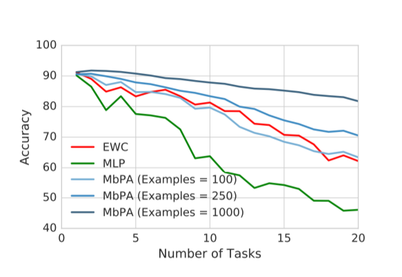
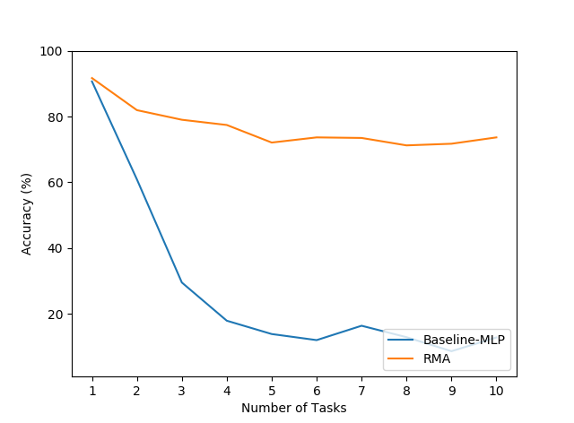
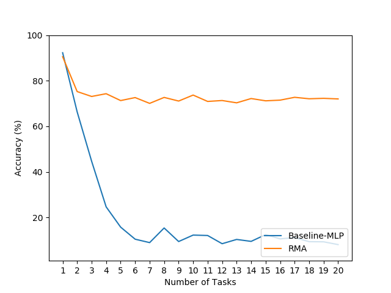
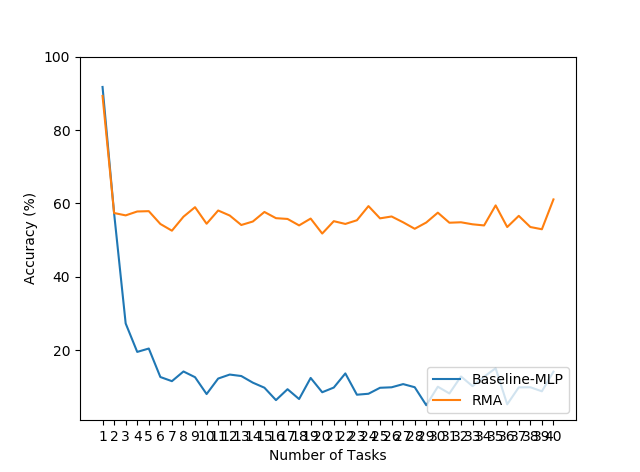

# Introduction.

I present in this repository a (very simple) random memory adaptation model (RMA) inspired by the Google DeepMind paper:

"Memory-based parameter adaptation (MbPA)" (https://arxiv.org/pdf/1802.10542.pdf)

In the paper, point 4.1. CONTINUAL LEARNING: SEQUENTIAL DISTRIBUTIONAL SHIFT (inside experiments and results), they study the improvements their model suppose in relation to the catastrophic forgetting problem.

They explored the effects of their model (MbPA) on continual learning, i.e. when dealing with the problem of sequentially learning multiple tasks without the ability to revisit a task.
For this purposed they use the permuted MNIST setup (Goodfellow et al., 2013).

In page 6 they mention about that once a task is catastrophically forgotten, they found that only a few gradient steps on carefully selected data from memory are sufficient to recover performance.

That point got my attention and I wondered if the same improvement could be reached in an easier (and faster) way using a different approach.

## Random memory adaptation model (RMA).

I played around with this idea and created a new model based in a random allocation access (instead of using as they did for MbPA a memory architecture similar to the Differentiable Neural Dictionary (DND) used in Neural Episodic Control (NEC) (Pritzel et al., 2017).
The random memory I used has an asymptotic cost of insertion of O(1) and it retrieves pairs of {k,v} also in order O(1). This is much better than what a sorted tree (DND) can do.

The way the RMA works is very straightforward:

1) We have a memory M = {(hi, vi)}. Keys {hi} are given by the embedding network (in the example of this repository the embedding function is the identity). More details in https://arxiv.org/pdf/1802.10542.pdf
2) In each step i of the training process we append the current training batch {xi, yi} to the end of the memory M, if and only if m steps lapsed since the last inserting. I.e., we add only a tiny and random fraction of the whole training dataset into the memory M.
3) In the training process, the backpropagation will be realized over an augmented batch composed by the current training batch i {xi, yi} plus a totally random tiny batch retrieved from the memory M.
3) We repeat this continue learning process for the n tasks in the same model and without further modification.

That's all.

## Results.

The development and use of the RMA is much easier than in the MPbA case, and also the performance of the algorithm is even better that in the DeepMind results.
The RMA is able to keep the past knowledge almost perfectly and with a minimal impact in the training time. Moreover, the RMA model does not need access to the test dataset like it's the case in the MPbA.

The only two hyper-parameters we have to chose are the memory size and how much training data we are going to store in the memory.

In the case of the permuted MNIST setup for example it's enough to have sufficient memory allocation to store some examples of all the tasks in order to remember how to solve all of them.
In fact, the task n only is forgotten once that all their past "memories" have been overwritten due to a memory no big enough (in relation to the number of tasks).

This is the DeepMind MbPA results in the permuted MNIST (Solving 20 tasks):

These are the results of a RMA with a memory of size 15.000 and where we memorize only 10 batches of the 10.000 used in each task, we can see we still got a great continuity learning ratio in test time.

Solving 10 tasks:

Solving 20 tasks:

Finally, these are the results of the same RMA with a memory of size 15.000, 10 batches of each 10.000 but resolving 40 tasks.

We can see that as long as there is memory for keeping some examples of every task the continual learning rate is very stable against the test dataset...and at the end we are just using a two layers MLP for all the job!! The augmented random memory really seems to do a great work against the catastrophic forgetting.

## Future work.

I'd like to check this same model in other tasks and also use a different embedding function (network) different of the identity one used here.
Also, there are a lot of possibilities to improve these results. An easy way would be just to keep an independent memory (Mi) for every different task in a similar way Neural Episodic Control(NEC) does for each action in the action space (Ma). Then we would retrieve a random equal proportion from every memory in any backpropagation step.

It'd be interesting too apply this method to some complex supervised task and look for some kind of improvement.

## Conclusions.

There is no doubt that the use of some kind of external memory like the one used in MbPA or the used in Neural Episodic Control (NEC) (Pritzel et al., 2017) is going to be a fundamental part of any model able to solve the main shortcomings of neural networks such as catastrophic forgetting, fast, stable acquisition of new knowledge, learning with an imbalanced class labels, and fast learning during evaluation.
I showed here that maybe an easy way to solve some of these problems resides just in the use of a random and fast external memory that stores "memories" of past events seen during the training process. It may be possible that we don't need to weighted over the whole memory, and that we don't need neither to use a sorted tree with a kernel able to return the nearest examples.
